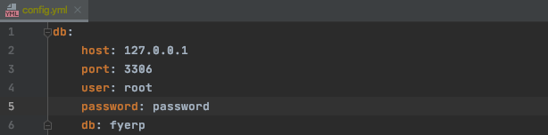
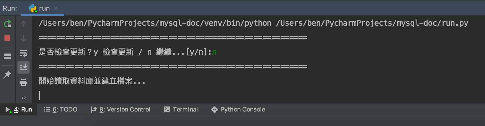
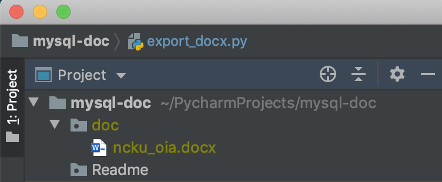
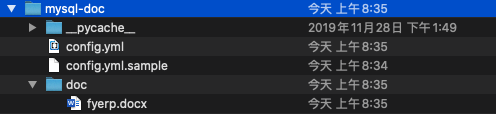
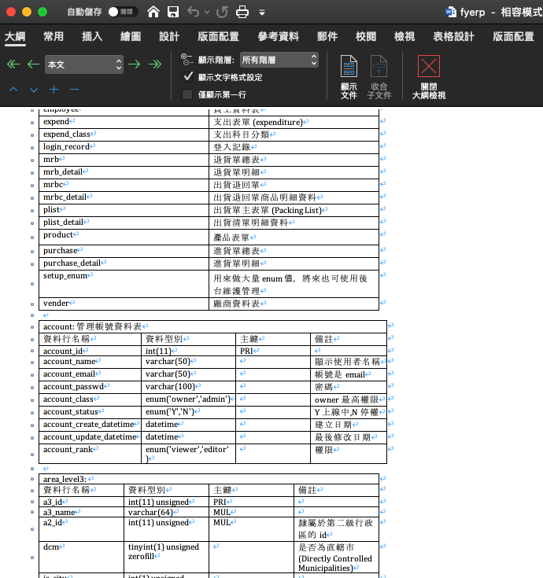

### 比對 2 個資料庫裡資料表數量、欄位資訊

這支小程式只能告訴你差異資訊，讓你知道 2 個資料庫中那裡不同，但仍要靠你手動更改資料庫、資料表欄位

---

**注意事項**

目前沒有

---

**執行環境**

python 3.7

---

**使用方式**

1. 把 config.yml.sample 拷貝一份為 config.yml，並設定 2 個資料庫

2. 安裝 python3，及 2 個套件
 
   `pip install pymysql` 和 `pip install pyyaml`

3. 視安裝環境而定，執行

   `python3 run.py` 或 `python run.py` 

4. 首先會比對 2 個資料庫裡資料表的數量及差異資料表名稱

   

5. 然後開始比對 2 個資料庫都有的資料表欄位，並顯示差異欄位

   

6. 比對結束後，再手動處理差異部份 (windows 建議使用 HeidiSQL 處理資料庫)

   

7. 如果是在終端機中使用，畫面顯示上稍有不同

   

8. 如果有差異的畫面 (windows)

   
   
9. 比對結果相同的畫面 (windows) 

   