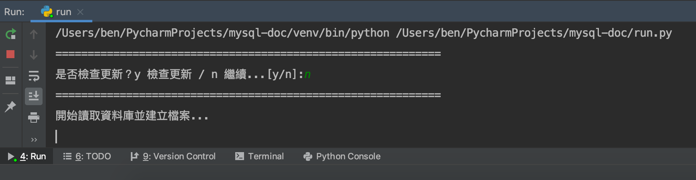
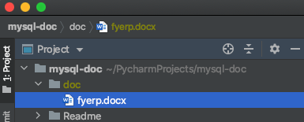
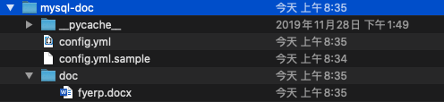
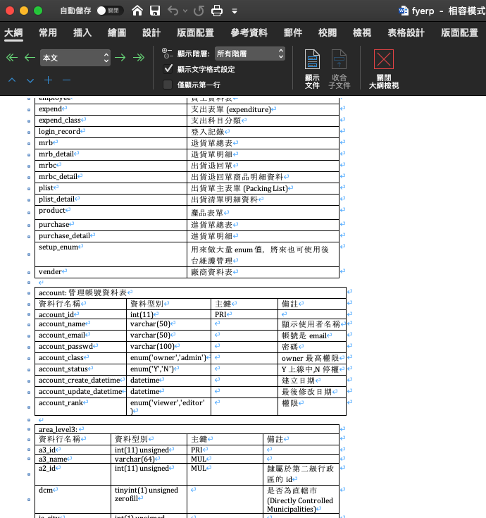

### 匯出 MySQL 資料表說明成為 word 文件

用 python 匯出 MySQL 資料庫中資料表的說明成為 word docx 文件，用來做驗收文件使用

---

**注意事項**

要在資料庫明確寫入資料表注釋、欄位注釋才會有註解，否則只是一些基本的欄位型態說明而以

---

**執行環境**

python 3.7

---

**使用方式**

1. 把 config.yml.sample 拷貝一份為 config.yml，並設定資料庫

   

2. 安裝 python3，及 2 個套件
 
   `pip install pymysql` 和 `pip install pyyaml` 和 `pip install python-docx`

3. 視安裝環境而定，執行

   `python3 run.py` 或 `python run.py`
   
   

4. 文件儲存在 doc 目錄下，以資料庫名稱為檔名

   
   
   在專案資料夾裡的 doc 裡面可以找到匯出的檔案
   
   
   
   會先列出資料表清單，然後逐一顯示每一張資料表結構
   
         
   
5. 手動做封面，或補其它資訊到 word 文件中
